# 🛑 [CLASSIFIED] CIA/NAVY SONAR REPORT
```
DEPT OF DEFENSE • OFFICE OF NAVAL INTELLIGENCE
---------------------------------------------
SUBJECT : SOVIET TYPHOON-CLASS "RED OCTOBER"
STATUS  : ACTIVE SONAR TRACKING
COMMANDER: MARKO RAMIUS (RAMIUS86)
---------------------------------------------
```

<p align="center">
  
</p>

### 📡 SONAR METRICS & TACTICAL DEPLOYMENT
The subject's operational status is linked to GitHub activity logs:

* 🟢 **Standard Route** (`happy.svg`) • *Caterpillar Drive Active.* Silent propulsion. Last push was &lt;24 hours ago.
* 🔵 **Silent Running** (`chill.svg`) • *Engines Static / Crew Singing.* Sonar detects faint hymns. Idle for 1-3 days.
* 🔴 **Red Alert** (`burnout.svg`) • *Crazy Ivan Maneuver.* High engine vibration. Heavy payload (&gt;15 commits in 24h).
* 🟣 **Night Surface** (`night.svg`) • *Recharging Batteries.* Surfaced under the red moon. Late-night push (00:00 - 05:00).
* 💀 **Abyssal Silence** (`ghost.svg`) • *Presumed Sunk.* Contact lost at 3000 fathoms in the Laurentian Abyss (no commits for &gt;3 days).

---
*Status computed dynamically by serverless GitHub Actions.*
